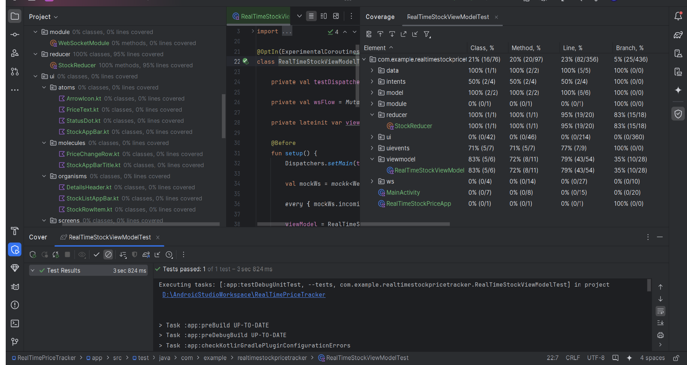
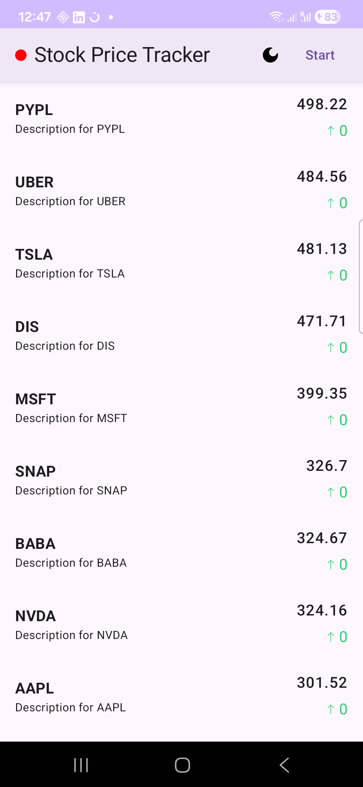
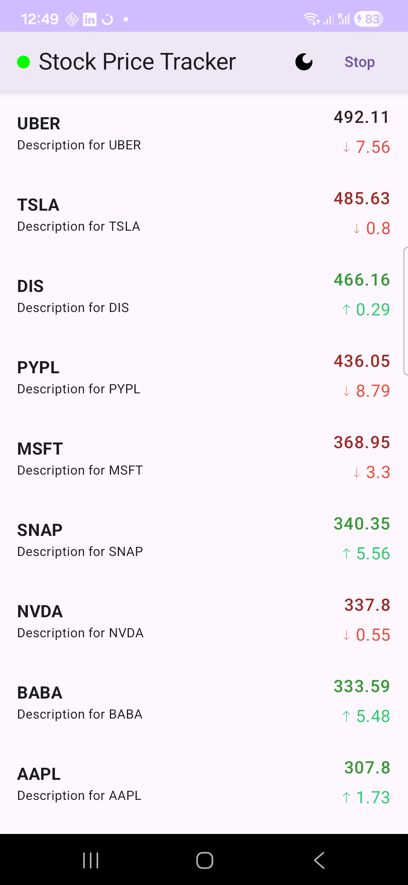
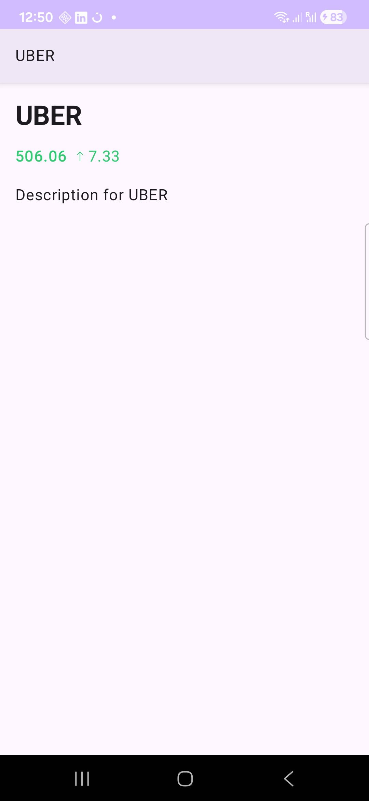
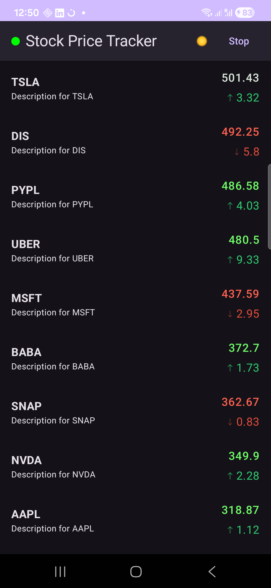
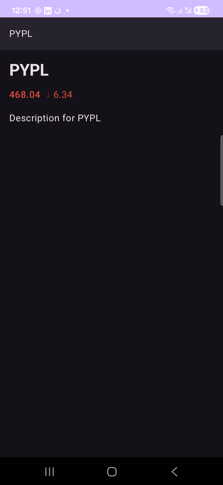

# RealTimeStockPriceTracker

# RealTimeStockPriceTracker  (Jetpack Compose, MVVM)

## Overview
- 25 symbols, updates every 2s
- Sends mock price updates to `wss://ws.postman-echo.com/raw`
- Receives echoed messages, updates UI via a single `ViewModel` with `StateFlow`
- LazyColumn sorted by price (highest first)
- Top bar has connection indicator, Sun Moon image button to change theme and Start/Stop toggle.
- Price flashes green/red for 1s on change
- Light/dark theme

## Architecture
MVVM:
- `RealTimeStockViewModel` holds immutable `StockUIState` as `StateFlow`
- `WebSocketManager` exposes `incomingMessages()` as a `Flow<String>`
- UI collects `state` and reacts to changes (unidirectional data flow)

UI: 
- UI is broken into atoms, molecules and organism structure for clean architecture

Dependency Injection Bonus
- Used Hilt Library for dependency Injection to inject view model web socket manager and repository

## How to run
1. Open in Android Studio by cloning https://github.com/faiz786/RealTimeStockPriceTracker.git.
2. Sync project.
3. Run `app` on an emulator/device with Internet access.

## Notes and Bonus features
- Flashing implemented: Price flashes green/red for 1s on increase/decrease.
- Tests: Test classes added in unit test folder.
- to run test simply go to unit test folder select class RealTimeStockViewModelTest and run it

- 

## Assumptions & Trade-offs
- Created 3 branches MVVM with repository, MVVM without repository and MVI Architecture with Simple String Messages to avoid JSON dependency  
- WebSocket reconnection logic is basic we check if web socket is null we retry; production code may prefer more robust connection state machine and backoff policy.

## Future enhancements
- Adding Room library to store price fluctuations and show graph with MQ chart or some other library.

## Screen Shots

